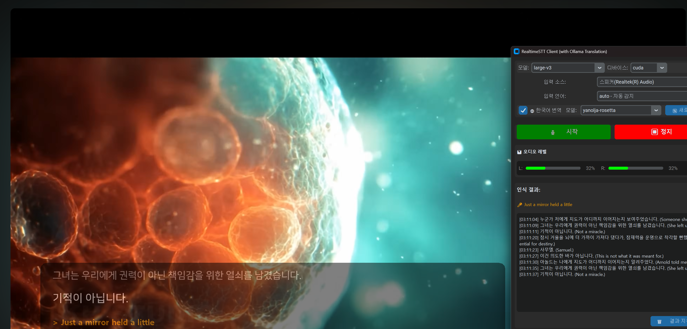
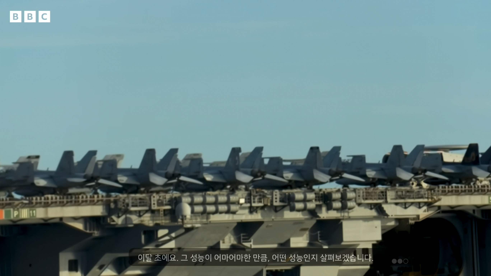

# Windy ASR

실시간 음성 인식 및 번역 클라이언트 (RealtimeSTT + Ollama)

## 개요

Windy ASR은 RealtimeSTT를 사용한 실시간 음성 인식과 Ollama를 통한 번역 기능을 제공하는 데스크톱 애플리케이션입니다.




### 주요 기능

- 🎙️ **실시간 음성 인식**: RealtimeSTT를 사용한 로컬 STT 엔진
- 🌐 **실시간 번역**: Ollama 모델을 활용한 번역 기능
- 📺 **자막 오버레이**: 화면 상단에 자막을 표시하는 오버레이 창
- 🎚️ **오디오 레벨 모니터링**: 좌/우 채널 오디오 레벨 시각화
- 🔊 **다양한 입력 소스**: 마이크 및 루프백 장치 지원
- 🌍 **다국어 지원**: 자동 감지, 중국어, 영어, 일본어, 한국어, 광둥어

## 시스템 요구사항

- Python 3.12 이상
- CUDA 지원 GPU (CUDA 버전의 경우, CPU 모드도 가능)
- Windows 10 이상

## 설치

1. **저장소 클론**
   ```bash
   git clone https://github.com/yusulike/windy-asr
   cd windy-asr
   ```

2. **가상환경 생성 (선택사항)**
   ```bash
   python -m venv .venv
   .venv\Scripts\activate
   ```

3. **의존성 설치**
   
   uv를 사용하는 경우:
   ```bash
   uv sync
   ```
   
   pip를 사용하는 경우:
   ```bash
   pip install -r requirements.txt
   ```

4. **Ollama 모델 설정**
   
   이 프로젝트는 커스텀 시스템 프롬프트가 적용된 [yanolja-rosetta](https://huggingface.co/yanolja/YanoljaNEXT-Rosetta-4B-2511-GGUF) 모델을 사용합니다.

   ```bash
   # Ollama 설치 (이미 설치된 경우 생략)
   # https://ollama.ai/download

   # Modelfile을 사용하여 커스텀 모델 생성
   ollama create yanolja-rosetta -f ollma/Modelfile
   
   # 생성된 모델 확인
   ollama list
   ```

## 사용 방법

### 기본 실행

**uv를 사용하는 경우:**
```bash
uv run app.py
```

**일반 Python을 사용하는 경우:**
```bash
python app.py
```

### 설정

애플리케이션은 `settings.json` 파일에 설정을 자동으로 저장합니다.

#### 주요 설정 항목

- **STT 모델**: tiny, base, small, medium, large-v3 등
- **디바이스**: CUDA (GPU) 또는 CPU
- **입력 언어**: 자동 감지, 중국어, 영어, 일본어, 한국어, 광둥어
- **번역 모델**: Ollama 모델 선택

### 오버레이 창 사용

1. 메인 창에서 **📺 오버레이** 버튼 클릭
2. 오버레이 창에서 우클릭하여 메뉴 열기:
   - 투명도 조절
   - 컴팩트 모드 전환
   - 자막 지우기

## 프로젝트 구조

```
windy-asr/
├── app.py                          # 메인 진입점
├── settings.json                    # 설정 파일
├── windy_asr/                      # 메인 패키지
│   ├── __init__.py
│   ├── config.py                   # 설정 관리
│   ├── services/
│   │   ├── __init__.py
│   │   ├── translation.py          # 번역 서비스 (Ollama)
│   │   └── stt.py                  # STT 클라이언트 (RealtimeSTT)
│   └── ui/
│       ├── __init__.py
│       ├── widgets.py              # UI 위젯
│       ├── overlay.py              # 자막 오버레이
│       └── main_window.py          # 메인 윈도우
└── pyproject.toml                  # 프로젝트 설정
```

## 의존성

주요 라이브러리:

- **RealtimeSTT**: 실시간 음성 인식
- **Ollama**: LLM 기반 번역
- **CustomTkinter**: 현대적인 GUI
- **SoundCard**: 오디오 입력 처리
- **PyTorch**: 딥러닝 모델 실행
- **Pillow**: 이미지 처리 (오버레이)

전체 의존성 목록은 `pyproject.toml`을 참조하세요.

## 문제 해결

### 오디오 입력 장치를 찾을 수 없음

- Windows 사운드 설정에서 마이크/루프백 장치가 활성화되어 있는지 확인
- 관리자 권한으로 실행 시도

### Ollama 모델을 찾을 수 없음

```bash
# Ollama 서비스가 실행 중인지 확인
ollama serve

# 모델 다시 생성
ollama create yanolja-rosetta -f ollma/Modelfile
```

### CUDA 오류

- NVIDIA 드라이버가 최신인지 확인
- CPU 모드로 전환: 설정에서 디바이스를 "cpu"로 변경

## 라이선스

이 프로젝트는 MIT 라이선스 하에 배포됩니다.

## 기여

버그 리포트, 기능 요청 및 풀 리퀘스트를 환영합니다!

## 참고

- [RealtimeSTT](https://github.com/KoljaB/RealtimeSTT)
- [Ollama](https://ollama.ai/)
- [CustomTkinter](https://github.com/TomSchimansky/CustomTkinter)
- [Yanolja Rosetta Model](https://huggingface.co/yanolja/YanoljaNEXT-Rosetta-4B-2511-GGUF)
